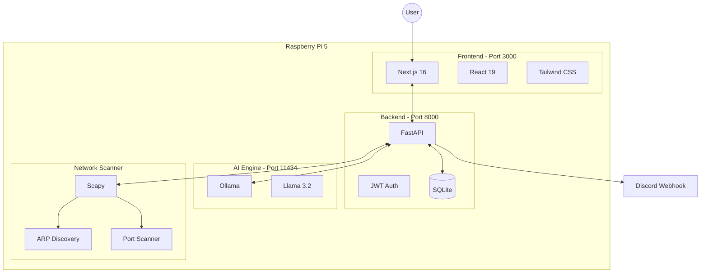
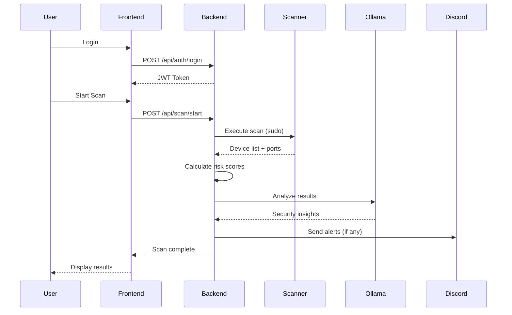
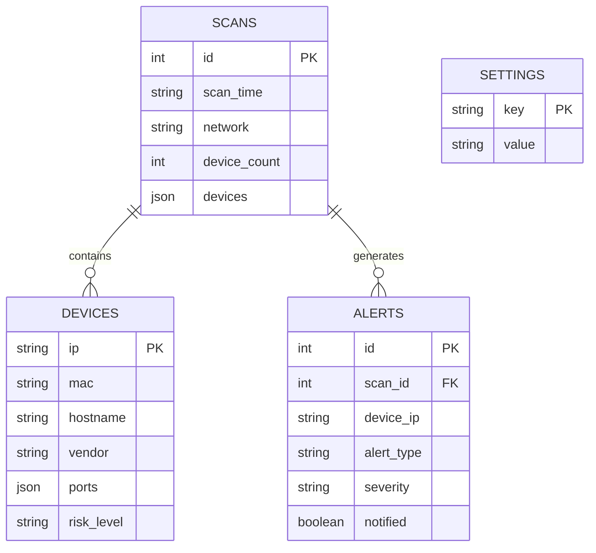
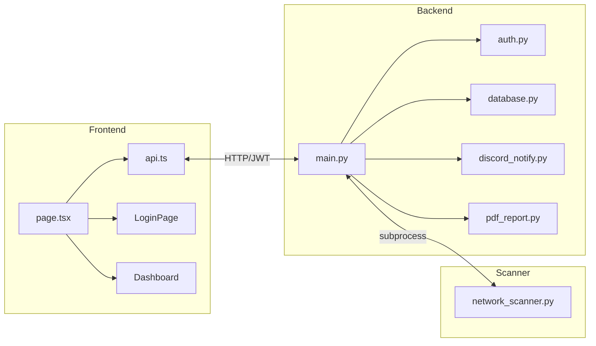

# Network Sentinel

AI-powered network security monitoring dashboard for Raspberry Pi.

  

## Screenshot


## Features

- **Network Scanning** - ARP-based device discovery with port scanning
- **AI Analysis** - Local AI security analysis powered by Ollama (Llama 3.2)
- **Risk Assessment** - Automatic risk scoring for each device
- **Discord Alerts** - Real-time notifications for security events
- **PDF Reports** - Generate professional security reports
- **Scheduled Scans** - Automatic scanning via cron
- **Authentication** - JWT-based login system

## Architecture

### System Overview



### Request Flow



### Data Model



### Component Architecture



## Tech Stack

**Backend:**
- Python 3.11 + FastAPI
- Scapy (network scanning)
- SQLite (database)
- Ollama (local AI)

**Frontend:**
- Next.js 16
- React 19
- Tailwind CSS (cyberpunk theme)

## Installation

### Prerequisites

- Raspberry Pi 4/5 (or any Linux machine)
- Python 3.11+
- Node.js 20+
- Ollama with Llama 3.2 model

### Setup

1. **Clone the repository**
```bash
git clone https://github.com/e-jaafar/network-sentinel.git
cd network-sentinel
```

2. **Install backend dependencies**
```bash
python3 -m venv venv
source venv/bin/activate
pip install -r requirements.txt
```

3. **Install frontend dependencies**
```bash
cd frontend
npm install
npm run build
cd ..
```

4. **Install Ollama and model**
```bash
curl -fsSL https://ollama.com/install.sh | sh
ollama pull llama3.2:1b
```

5. **Create data directory**
```bash
mkdir -p data
```

6. **Start the services**
```bash
# Backend
source venv/bin/activate
uvicorn backend.main:app --host 0.0.0.0 --port 8000

# Frontend (in another terminal)
cd frontend
npm run start
```

### Systemd Services (Optional)

Copy the service files for automatic startup:
```bash
sudo cp network-sentinel-backend.service /etc/systemd/system/
sudo cp network-sentinel-frontend.service /etc/systemd/system/
sudo systemctl daemon-reload
sudo systemctl enable network-sentinel-backend network-sentinel-frontend
sudo systemctl start network-sentinel-backend network-sentinel-frontend
```

## Usage

1. Access the dashboard at `http://<your-pi-ip>:3000`
2. Login with default credentials:
   - **Username:** `admin`
   - **Password:** `sentinel`
3. Click "New Scan" to discover devices on your network
4. View AI-powered security analysis

## API Endpoints

| Endpoint | Method | Description |
|----------|--------|-------------|
| `/api/auth/login` | POST | Authenticate user |
| `/api/scan/latest` | GET | Get latest scan results |
| `/api/scan/start` | POST | Start new network scan |
| `/api/ai/quick-summary` | GET | Get AI security summary |
| `/api/ai/analyze` | POST | Get detailed AI analysis |
| `/api/report/pdf` | GET | Generate PDF report |
| `/api/settings/discord` | POST | Configure Discord webhook |

## Project Structure

```
network-sentinel/
├── scanner/
│   └── network_scanner.py   # Scapy-based network scanner
├── backend/
│   ├── main.py              # FastAPI application
│   ├── auth.py              # JWT authentication
│   ├── database.py          # SQLite operations
│   ├── discord_notify.py    # Discord webhooks
│   └── pdf_report.py        # PDF generation
├── frontend/
│   ├── src/app/             # Next.js app router
│   └── src/lib/api.ts       # API client
├── data/                    # Scan results & database
├── scheduled_scan.py        # Cron job script
└── *.service                # Systemd service files
```

## Security Notes

- Change the default password after first login
- Network scanning requires root/sudo privileges for ARP packets
- All processing is done locally - no data leaves your network
- The AI model runs entirely on your Raspberry Pi
- All API endpoints (except login) require JWT authentication

## License

MIT License - Feel free to use this for your own projects!

## Author

Made with ❤️ by [e-jaafar](https://github.com/e-jaafar)
